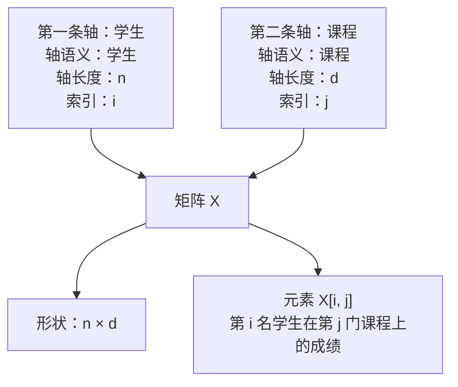
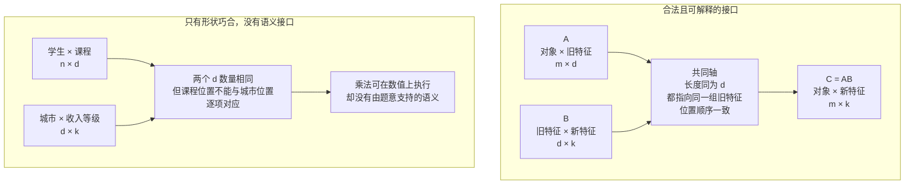
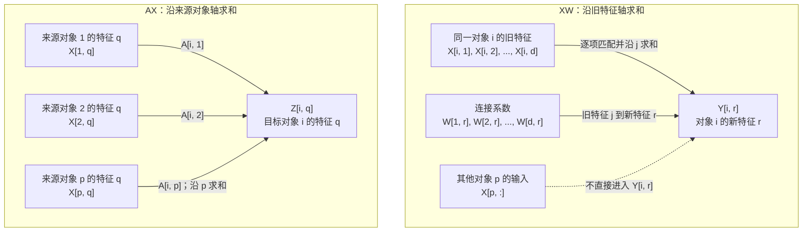

# 第1章图示：矩阵表达式的语义基础

本文件保存第1章第一轮图示。图示只承担正文中容易依靠文字造成认知负担的部分，不重复正文段落，也不引入第2—4章尚未正式讲授的内容。

当前图示使用 Mermaid 保存结构与信息关系，后续出版时可根据同一结构转换为统一风格的 SVG 或矢量插图。

## 图1-1 轴语义、轴长度与元素位置

### 建议位置

放在第1章 1.2 节“把矩阵看成带轴语义的数据结构”中，紧接 `X: 学生 × 课程` 与 `X: 4 × 3` 的首次对照之后。

### 教学目标

让读者同时看见三件不同的事：轴语义说明位置代表谁，轴长度说明每条轴有多少位置，索引说明当前选择轴上的哪个位置。图中不能把 `n`、`d` 直接写成“对象轴”或“课程轴”。



### 图注

**图1-1　矩阵需要同时标注轴语义和轴长度。** `n × d` 只记录两条轴分别有多长；“学生 × 课程”才说明各位置代表什么；`i`、`j` 用于选择轴上的具体位置。

### 黑白排版备用结构

```text
                         第二条轴：课程
                         轴长度：d，索引：j
                              ----->

第一条轴：学生       X[i, j]
轴长度：n，索引：i   第 i 名学生在第 j 门课程上的成绩
      |
      v

X 的轴语义：学生 × 课程
X 的形状：n × d
```

### 对应练习

- 练习1：区分轴、长度与索引。
- 练习2：判断相同形状是否代表相同语义。

## 图1-2 相乘接口同时要求数量一致与语义一致

### 建议位置

放在第1章 1.3 节“从形状到轴：输入、输出与相乘接口”中，在“数量接口”和“语义接口”两个定义之后。

### 教学目标

把“内侧维度相同”从最终判断降为第一道检查。读者应看到：只有共同轴长度相同、所指向的位置集合相同且顺序一致，两个输入才形成可解释的相乘接口。



### 图注

**图1-2　相乘接口包含数量条件和语义条件。** 共同轴长度相同只能说明数值计算可以进行；共同轴还必须指向同一组实体或特征，并采用一致的位置顺序，结果才能获得稳定解释。

### 黑白排版备用结构

```text
合法接口：

A: 对象 × 旧特征       B: 旧特征 × 新特征
          \             /
           \ 共同轴：旧特征
            \ 长度 d，位置逐项一致
             v
          C = AB: 对象 × 新特征

只有形状巧合：

学生 × 课程(d)    城市(d) × 收入等级
          \         /
           \ 数量同为 d，但位置含义冲突
            v
       数值可算，语义不能据此成立
```

### 对应练习

- 练习3：检查相乘接口。
- 练习4：从元素展开追踪共同轴。

## 图1-3 `XW` 与 `AX` 的求和方向对照

### 建议位置

放在第1章 1.6 节“`XW` 与 `AX`：两种求和方向的初步对照”中，在两个元素式都出现之后、文字总结之前。

### 教学目标

不依靠“左乘”“右乘”记忆规则，而是让读者直接比较两个元素式中哪个索引被遍历。`XW` 固定对象、沿旧特征轴求和；`AX` 固定目标对象和特征、沿来源对象轴求和。



### 图注

**图1-3　共同轴不同，矩阵乘法执行的信息动作就不同。** 在 `XW` 中，旧特征索引 `j` 被求和，对象 `i` 保持固定；在 `AX` 中，来源对象索引 `p` 被求和，多个来源对象的信息进入目标对象 `i`。

### 黑白排版备用结构

```text
XW：固定对象 i，沿旧特征 j 求和

X[i,1] --W[1,r]--\
X[i,2] --W[2,r]---+--> Y[i,r]
...                |
X[i,d] --W[d,r]--/

其他对象 X[p,:] 不直接进入 Y[i,r]

AX：固定目标对象 i 和特征 q，沿来源对象 p 求和

X[1,q] --A[i,1]--\
X[2,q] --A[i,2]---+--> Z[i,q]
...                |
X[p,q] --A[i,p]--/
```

### 对应练习

- 练习6：比较两类求和方向。
- 练习7：判断任务需要特征变换还是对象聚合。

## 本轮图示验收标准

三张图示应共同满足以下要求：

```text
图1-1：读者能区分轴语义、轴长度和索引
图1-2：读者能区分数量接口与语义接口
图1-3：读者能通过求和索引判断 XW 与 AX 的信息动作
```

图示不承担以下内容：

- 不解释 `W` 如何训练；
- 不解释关系矩阵 `A` 如何构造或归一化；
- 不把右乘、左乘写成脱离轴布局的普遍定律；
- 不使用颜色作为唯一的信息区分手段；
- 不用模型名称代替轴、索引和信息流解释。

## 外部试读检查项

在第1章试读时，分别记录读者第一次看到三张图后的回答：

1. 图1-1：`n`、`i` 和“学生轴”分别是什么？
2. 图1-2：为什么两个内侧长度都是 `d` 仍可能没有语义接口？
3. 图1-3：`Y[i, r]` 是否直接读取其他对象的输入？`Z[i, q]` 沿哪类对象求和？

若读者仍需返回大段正文才能回答，说明图示的信息层级或标注需要调整。